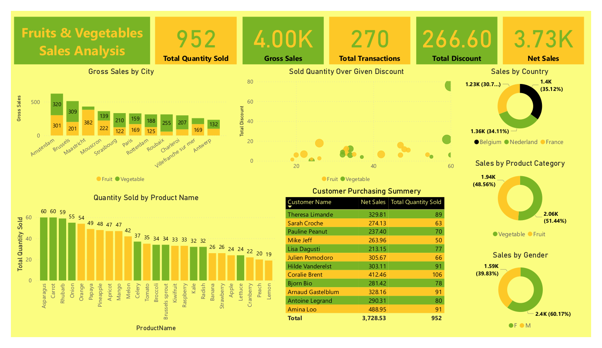

# Fruits and Vegetables Sales Analysis

## Live Report
**View the live interactive Power BI report here:**
[Click to Open Report](https://app.powerbi.com/view?r=eyJrIjoiODFlYTI4ZGQtMmYyNi00YjY2LWFhMTUtZmQ2Y2NlZmYyZjU2IiwidCI6IjI1Y2UwMjYxLWJiZDYtNDljZC1hMWUyLTU0MjYwODg2ZDE1OSJ9
)  
*(Hosted on Power BI Service)*

## Project Overview 

This report delivers a data driven analysis of fruits and vegetables sales, leveraging Power BI for impactful visualization. It explores key business metrics from net and gross sales to transaction trends, customer behavior, and discount effectiveness offering valuable insights for strategic decision making.

Designed for data enthusiasts, business analysts, and sales teams, this analysis provides a clear snapshot of performance across multiple dimensions, enabling informed decisions and optimizing revenue strategies.

## Key Insights

- Vegetables contribute slightly more to total sales (51.44%) than fruits (48.56%), offering opportunities for category-specific strategies.
- Male customers drive 60.17% of sales, indicating a potential market focus for targeted promotions.
- Belgium leads in sales (35.12%), followed closely by Nederland (34.11%) and France (30.7%), highlighting strong regional demand.
- Asparagus, Carrot, and Rhubarb rank highest in quantity sold, suggesting customer preferences for seasonal produce
- msterdam and Brussels show the strongest revenue generation, reflecting urban market dynamics.
- Higher discounts correlate with increased quantity sold, showcasing the impact of pricing strategies on sales volume.
- The top buyer, Amina Loo, has the highest net sales (488.95), indicating repeat purchasing behavior that can be leveraged for customer loyalty programs.

##  Dataset Information 

- **Data Source:** Youtube Chanel-Data Visionary (https://www.youtube.com/@DataVisionary https://drive.google.com/drive/folders/1DshD-Ud037J1ij9QPiyrLghjYRXClZGq)  
- **File Type:** Excel
- **File Size:**  21 KB
- **Number of Table:** 3
  - Customer Details - Number of Fields(10)
  - Product Details - Number of Fields(5)
  - Sales - Number of Fields(6) 
- **Number of Record:** 270 (Sales)

## Tools & Technologies Used 

- Power BI (Data Modeling/Data Visualization)  
- Power Query (Data Extracting/Data Cleaning)

## Project Workflow 

1.**Data Collection & Import**
- Imported the dataset into Power BI Desktop for transformation and visualization from Excel Workbook.

2.**Data Cleaning & Transformation**
- Removed duplicates and empty rows.
- Applied meaningful naming conventions to columns and tables

3.**Data Modeling**
- Designed a star schema with
  - Fact Table: Sales Table
  - Dimension Tables: Customer Details Table , Products Details Table
  - Defined proper relationships (one-to-many) between dimension and fact tables.
  - Implemented calculated columns

4.**DAX Measures Creation**
  - Built custom DAX measures for,
    - Net Sales
    - Gross Sales
    - Total Quantity Sold
    - Total Discount
    - Total Transactions

5.**Dashboard Design**
- Create an interactive and intuitive dashboard including following components in power BI,
    - KPI Cards: Net Sales, Gross Sales, Quantity Sold, Tran
    - sactions, Total Discount
    - Bar/Column Charts:Sales by Gender,Sales by Product Category,Quantity by Product Name
    - Scatter Chart: Discount vs Quantity Sold by Category
    - Table: Customer-wise summary with Net Sales & Quantity
- Design Practices,
    - Consistent color coding (e.g., green for vegetables, orange for fruits).
    - Clean layout with proper spacing and alignment.

6.**Insight Extraction & Presentation**
- Identified key business insights
    - Female customers contributed to ~60% of sales.
    - Vegetables slightly outsold fruits in value.
    - Top-selling cities: Brussels, Amsterdam, Antwerp.
    - Best-selling products: Asparagus, Carrot, Rhubarb.
    - Loyal/high-value customers: Amina Loo, Coralie Brent, Theresa Limande.
- Delivered the report in PBIX, PDF, and Power BI Service formats for accessibility.
    
## Dashboard Preview

 

## Project Structure 

<pre style="background: #fff; padding: 0; border: none; font-family: monospace;">
📂 Fruits-and-Vegetables-Sales-Analysis/ 
    
  │-- 📁 RawData/ # Contains raw and processed datasets 
  
        |-- Fruits And Vegetable Sales Data.xlsx
  
  │-- 📁 FruitsAndVegetablesSalesAnalysis.pbix/    

  │-- 📁 FruitsAndVegetablesSalesAnalysis.pdf/ 
  
  │-- 📁 FruitsAndVegetablesSalesAnalysis.png/ # Report images
    
  │-- 📄 LICENSE/ # License Details/ 
  
  │-- 📄 README.md # Project documentation/

  
</pre>

## How to Use 

- Use the web [link](https://app.powerbi.com/view?r=eyJrIjoiODFlYTI4ZGQtMmYyNi00YjY2LWFhMTUtZmQ2Y2NlZmYyZjU2IiwidCI6IjI1Y2UwMjYxLWJiZDYtNDljZC1hMWUyLTU0MjYwODg2ZDE1OSJ9) to view the     report online, or download the [FruitsAndVegetablesSalesAnalysis.pbix](FruitsAndVegetablesSalesAnalysis.pbix) file to access and edit it using Power BI Desktop.
- Use the attached [FruitsAndVegetablesSalesAnalysis.pdf](FruitsAndVegetablesSalesAnalysis.pdf) file to read a detailed overview of the report and share it easily with others

## Future Improvements 

- Implement sales forecasting using built-in Power BI analytics or DAX time intelligence functions.
- Introduce customer tiers (e.g., high spenders, frequent buyers) for better targeting and marketing strategies.
- Add cost data to calculate and visualize gross and net profit margins.

## References

- Data Visionary (Youtube Chanel):[Dataset/Project Inspiration](https://www.youtube.com/@DataVisionary https://drive.google.com/drive/folders/1DshD-Ud037J1ij9QPiyrLghjYRXClZGq)
- Power BI Documentation: [Learn More](https://learn.microsoft.com/power-bi/)

